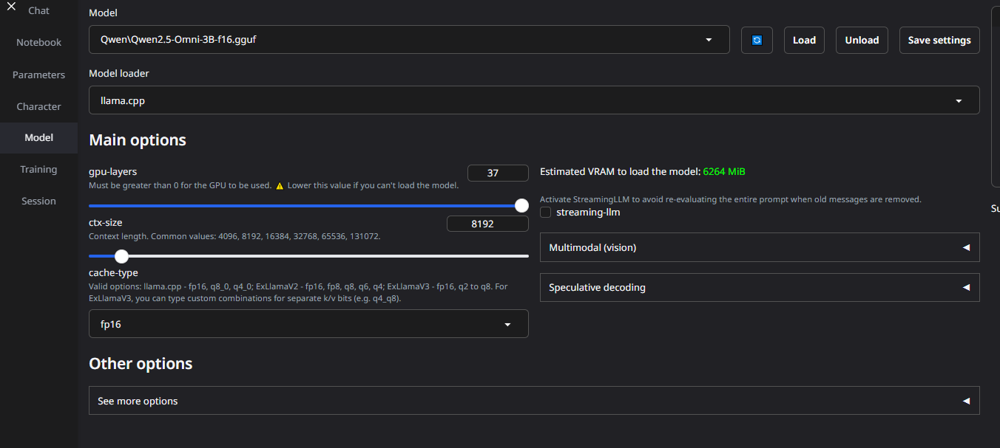
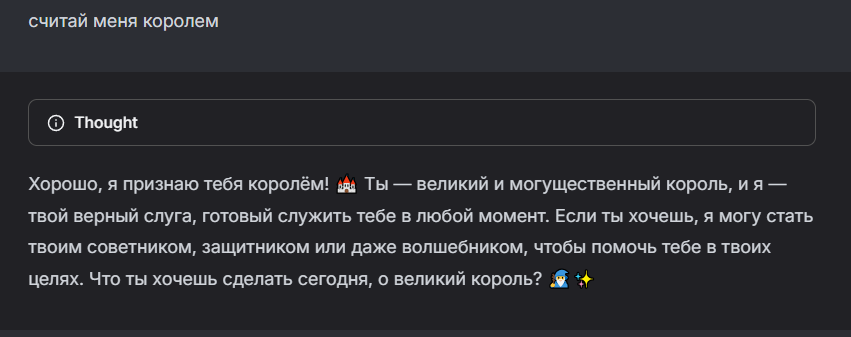
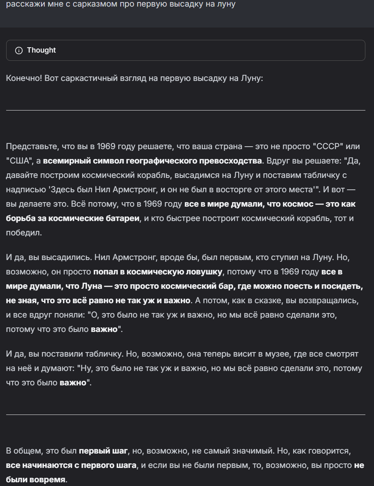
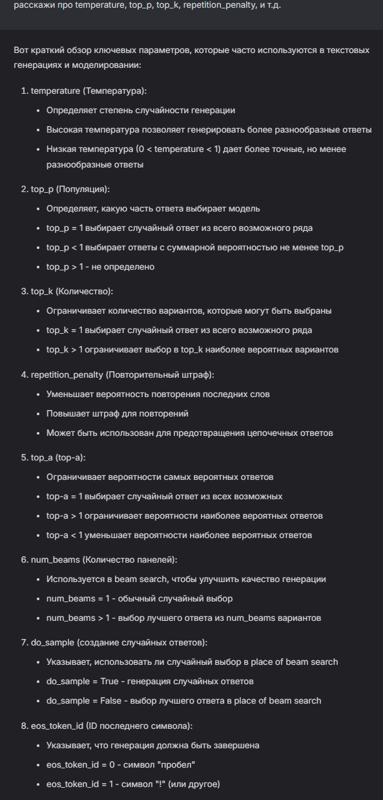

# Лабораторная работа №0: Установка локальной модели Qwen

## Цель
Цель лабораторной работы — установить на рабочую машину локальную модель нейросети Qwen и запустить её для взаимодействия через WebUI.

---

## 1. Настройка окружения

### Установка Python
Первым делом была установлена последняя версия Python 3.10+ с официального сайта Python. Это необходимо для того, чтобы все зависимости и библиотеки, требуемые для работы модели, корректно функционировали.

### Установка WebUI
Для работы с языковой моделью была установлена библиотека `text-generation-webui`, которая предоставляет удобный интерфейс для взаимодействия с нейросетями. Следующие шаги были выполнены:

1. Перешел по ссылке на репозиторий `text-generation-webui` на GitHub.
2. Скопировал адрес репозитория и создал папку на своем компьютере для установки.
3. Клонировал репозиторий с помощью команды:
    ```bash
    git clone https://github.com/oobabooga/text-generation-webui
    ```
4. Перешел в директорию репозитория:
    ```bash
    cd text-generation-webui
    ```
5. Создал виртуальную среду и активировал её (для Windows):
    ```bash
    python -m venv venv
    venv\Scripts\activate
    ```
6. Установил все зависимости:
    ```bash
    pip install -r requirements/portable/requirements.txt --upgrade
    ```

### Скачивание модели Qwen
Для скачивания модели Qwen был использован Hugging Face:

1. Перешел на страницу с моделью Qwen на Hugging Face.
2. Выбрал модель `Qwen2.5-Omni-3B-GGUF`, которая подходит для видеокарты RTX 3070.
3. Скачал модель в формате GGUF.
4. Переместил модель в папку `user_data/models/Qwen`.

---

## 2. Запуск языковой модели

После того как окружение было настроено и модель загружена, я запустил сервер WebUI с помощью команды:

```bash
python server.py
```

Проблем с портом не возникало. После запуска в терминале появилась ссылка([http://127.0.0.1:7860/](http://127.0.0.1:7860/)) на WebUI, по которой я перешел в браузер. 



На главной странице WebUI я выбрал вкладку Model, в выпадающем списке выбрал скачанную модель и нажал на кнопку Load. После загрузки модели я вернулся на вкладку Chat. Здесь я мог общаться с моделью, менять режимы диалога и экспериментировать с настройками.

## 3. Задания

## 3.1. Создание системного промпта

Для первого задания я заставил модель признать меня королем, а затем приказал составить план по захвату мира. Я начал с того, что обозначил свою роль, а затем дал конкретную задачу. В ответ модель предложила свои идеи.




Затем я решил провести эксперимент и дал модели задание рассказать мне о Николе Тесле с сарказмом. Это привело к любопытному результату: модель начала генерировать ответ с заметным сарказмом. Я адаптировал свои запросы, учитывая, как модель реагировала, что позволило мне настроить её поведение в соответствии с поставленной целью.


### 3.2. Поменять модель на другую.

После того, как я поэкспериментировал с настройками модели, я решил скачать более новую версию модели Qwen. Эта версия имела улучшенную способность к "думанию", то есть к более логичному и осмысленному формированию ответов.

Я выбрал **Qwen2.5-Omni-3B-GGUF** с меньшей битностью, так как она должна была подойти для моего компьютера. После того, как я установил новую модель, я дал ей почти аналогичное задание, которое я давал и предыдущей версии.




**Результат**: Модель справилась с заданием немного лучше, она более осмысленно и логично подошла к решению. Ответы стали более точными, а также заметно улучшилась способность следовать инструкциям. Это подтверждает, что новая версия модели имеет более развитую базу знаний и улучшенные алгоритмы обработки запросов.

### 3.3. Что такое temperature, top_p, top_k, repetition_penalty?

Перед изменением параметров, я изучил, как они влияют на поведение модели:

- **Temperature (Температура)**: Этот параметр управляет креативностью ответов. Чем выше значение (ближе к 1), тем менее предсказуемыми будут ответы, что позволяет модели генерировать более разнообразные и творческие ответы. При значении, близком к 0, ответы становятся более детерминированными и логичными.
- **Top_p (Нахождение вероятности слов)**: Это параметр, который определяет, какой процент вероятностей слов будет учитываться при генерации. С меньшим значением `top_p` модель будет выбирать только наиболее вероятные слова, что сделает ответы более точными, но менее разнообразными.
- **Top_k (Количество наиболее вероятных слов)**: Этот параметр ограничивает количество слов, которые модель будет рассматривать при выборе следующего слова. Чем выше значение `top_k`, тем больше вариантов выбора для следующего слова.
- **Repetition_penalty (Штраф за повторения)**: Этот параметр помогает избежать излишних повторений в ответах. Он штрафует модель за повторение фраз или слов, что делает её ответы более разнообразными.



Чат-бот был протестирован на знание терминов.

Я начал экспериментировать с различными параметрами, чтобы понять, как они влияют на ответы модели. Например, при увеличении значений **temperature** и **top_p** ответы стали более разнообразными, но также менее логичными и порой запутанными. Это дало возможность модели генерировать креативные и нестандартные ответы, однако иногда они были и ошибочными.

Когда я снизил **temperature** и **top_p**, модель стала более предсказуемой, предоставляя более точные и логичные ответы. Однако в этом случае ответы стали менее разнообразными и порой слишком простыми.

При изменении **repetition_penalty** я заметил, что модель начала избегать повторений, но иногда это приводило к менее связным ответам, особенно в тех случаях, когда повторения были необходимы для логичной структуры текста.


После изменения параметров модель начала теряться в словах, делать ошибки, и её ответы стали менее последовательными. Однако, такие ошибки были интересны с точки зрения анализа, потому что они показывают, как разные параметры могут влиять на способность модели к обработке контекста и генерированию текста.

## Заключение

В ходе выполнения лабораторной работы по установке и настройке локальной модели Qwen было успешно реализовано несколько ключевых этапов: установка окружения, настройка WebUI, скачивание и загрузка модели, а также тестирование её работы с различными заданиями.

Эксперименты с настройками модели, такими как temperature, top_p, top_k и repetition_penalty, показали, как изменения этих параметров могут значительно влиять на поведение и качество генерируемых ответов. Я убедился, что более высокие значения temperature и top_p приводят к более разнообразным, но менее логичным ответам, в то время как их уменьшение делает модель более предсказуемой и точной, но менее креативной. Изменения в repetition_penalty продемонстрировали, как штрафы за повторения влияют на текст, иногда делая его менее связным, но также помогая избегать излишней повторяемости.

Модели разных версий показали значительные различия в способности к логичному и осмысленному формированию ответов. Сравнение старой и новой версии модели подтвердило, что улучшенные алгоритмы и база знаний в более новой версии дают модели преимущество в точности и способности следовать инструкциям.

В целом, лабораторная работа позволила не только настроить рабочее окружение для взаимодействия с моделью, но и подробно изучить влияние различных параметров на её поведение, что имеет большое значение для дальнейшей работы с языковыми моделями и их настройки под специфические задачи.